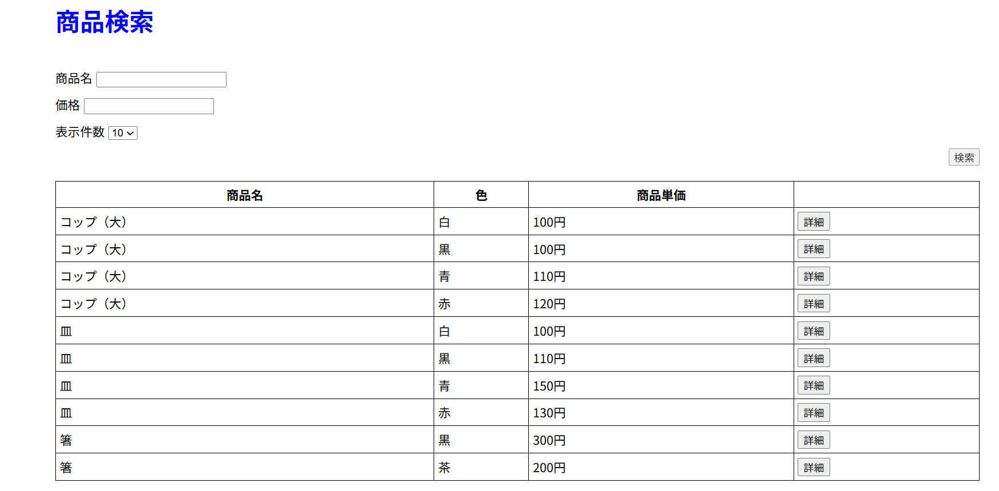
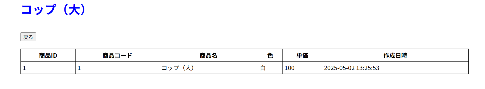

# 商品検索ページ（PHP × MySQL × Docker）

このリポジトリは、PHPとMySQLを用いた**商品検索ページのWebアプリケーション**です。  
Docker環境上で開発・動作し、簡単な検索フォームから商品情報を絞り込み表示できます。

---

## 機能概要

- 商品名と価格からの検索機能
- 検索結果の一覧表示（商品名・色・価格）
- 表示件数の選択機能（10 / 20 / 30件）
- 商品の詳細ページリンク付き
- バリデーションエラー表示

---

## 使用技術

- **言語**：PHP（バージョン7.4）
- **データベース**：MySQL（バージョン5.7）
- **サーバー**：Apache
- **その他**：Docker / Docker Compose / HTML / CSS

---

## ディレクトリ構成

php-product-app/  
├── docker-compose.yml  
├── Dockerfile  
├── init.sql  
├── doc_root/  
│ ├── index.php  
│ ├── detail.php  
│ └── stylesheet.css  


---

## 実行イメージ

### 商品検索画面


### 商品詳細画面


---

## 実行方法

### 1. 環境を立ち上げる

```bash
docker-compose up --build -d
```
### 2. 初期データを作成する(Windowsの場合)

```bash
Get-Content init.sql | docker exec -i php-product-app-db-1 mysql -umysql -pmysql test
```

### 3. Webアプリにアクセス
ブラウザで以下にアクセスできます。
http://localhost:8080
